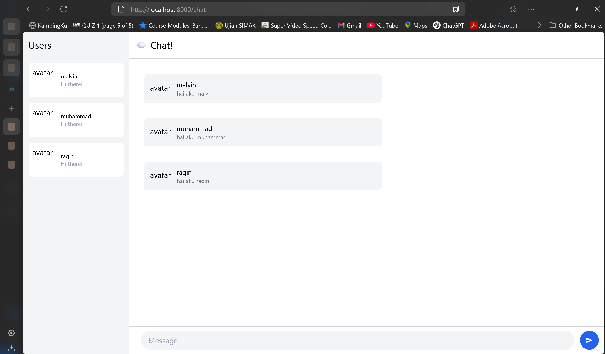
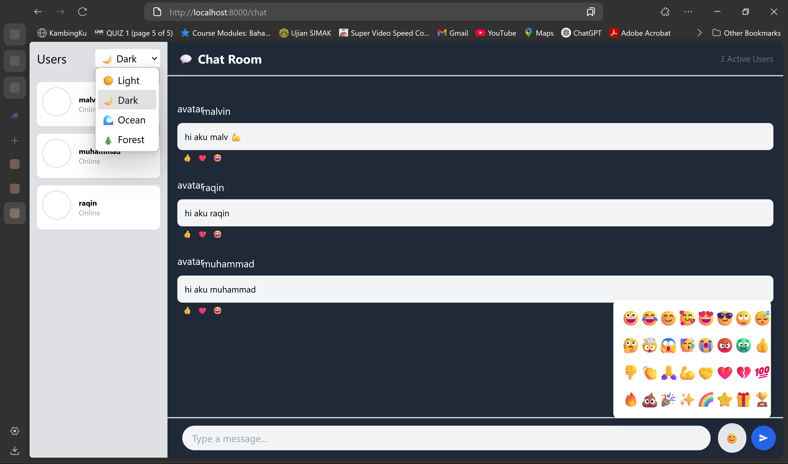

### 1. Original Code

### 2. Be Creative

added an emoji picker that opens when you click the 😊 button, showing a grid of 32 popular emojis that you can click to insert into your message. The theme changer is a dropdown in the users sidebar with 4 options (Light, Dark, Ocean, Forest) that dynamically changes the entire chat's color scheme. The emoji picker automatically closes after selecting an emoji and adds it to your current message. Each theme has different background colors and text colors that apply to the whole interface. Both features work seamlessly together to let users personalize their chat experience.